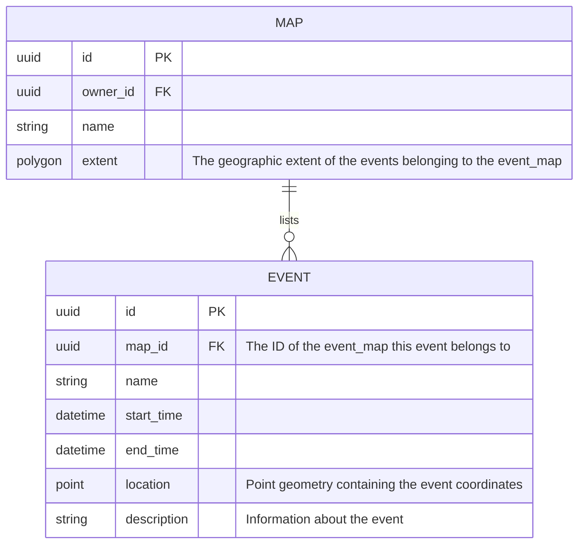

# DB

```mermaid
erDiagram
    MAP ||--o{ EVENT : lists
    MAP {
      uuid id PK
      uuid owner_id FK
      string name
      polygon extent "The geographic extent of the events belonging to the event_map"
    }
    EVENT {
      uuid id PK
      uuid map_id FK "The ID of the event_map this event belongs to"
      string name
      datetime start_time
      datetime end_time
      point location "Point geometry containing the event coordinates"
      string description "Information about the event"
    }
```
